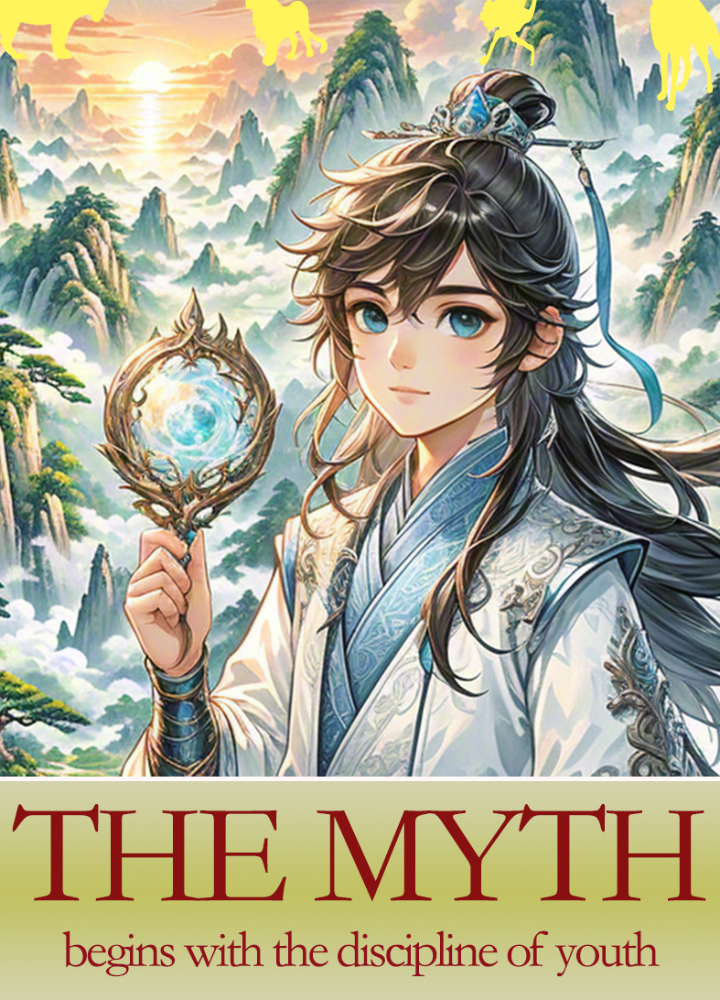

# books

# 001-Legend of the Cultivationist

# 002-The myth begins with the discipline of youth

Lohan Fist + Sun Wheel Seal = Iron Fist  
Iron Fist + Dragon Locking Skill = Northern Sea Dragon Combat  
Red Flag Command + Heavenly Capital Hidden Dragon Technique + Lohan Boy Skill = Red Dragon Capital Heavenly Secret...  
In the vast land of the Red County, amidst the boundless earth, the imperial dynasties, noble families, sects, and dark forces engage in an endless struggle.  
The Battle-Saint Body, the Golden Glass Saint Body, the Ninefold Dragon Ascension Body, the Tathagata Saint Body... the contest for supremacy of physiques.  
A young man, holding the Divine Mirror, steps forward, gradually forging his own legend.

``